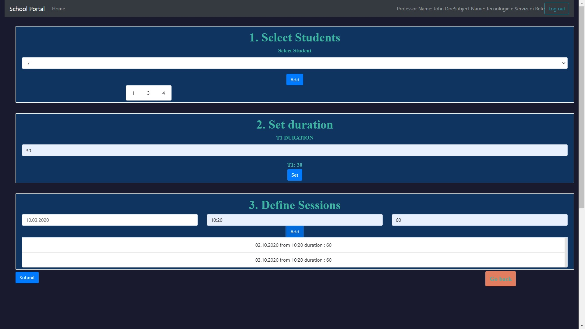

# Exam #3: "Scheduling oral test"
## Student: s278000 PELLITTIERI VITTORIO

## React client application routes

- Route `/`: homepage with links to teacherPortal and studentPortal
- Route `/login`: used to login teacher
- Route `/teacherPortal`: page with all the possible functionality for the teacher
- Route `/teacherPortal/createAnExam`: page where the teacher can create a new Exam
- Route `/teacherPortal/selectSlot`: list of all the possible students that has been scheduled for the oral testing
- Route `/teacherPortal/selectSlot/:slotId`: page in which the teacher can give a mark to the student, slotId is the id of the slot that has been booked
- Route `/teacherPortal/studentsMarks`: page containing for eache students that has been selected the
associated booked slot or mark
- Route `/studentAuthentication`: used to authenticate the student through his id
- Route `/studentPortal`: page with all the possible functionality for the student
- Route `/studentPortal/examList`: list of all the possible exams that the student can book
- Route `/studentPortal/examList/:examId`: list of all the possible slots associated to an exam that the student can book, examId is the exam from which the list of slots came
- Route `/studentPortal/viewBookedSlot`: list of the slots that the student has booked (he/she has the possibility of cancel the booking) and of the exams that he/she has passed
- ...

## REST API server

- GET `/api/bookableExam/:studentId`
  - parameters: id of the student
  - list of bookable exams

- GET `/api/bookableSlots/:examId`
  - parameters: id of the associated exam
  - list of bookable slots

- PUT `/api/slots/book/`
  - passes the booked slot
  - returns the id of the slot booked

- GET `/api/bookedSlots/:studentId`
  - parameters: id of the student
  - list of booked slots

- PUT `/api/slots/removeBooking/`
  - passes the booking of the slot to update
  - returns the id of the slot not anymore booked

- GET `/api/checkStudent/:studentId`
  - parameters: id of the student
  - checks if the id of the student exists

- GET `/api/students/:id`
  - parameters: id of the professor
  - students associated to a professor

- POST `/api/exams`
  - passes the created exam
  - returns the examId of the exam just created

- POST `/api/bookableExam`
  - passes the bookableExam (possibility to a student to book an exam)
  - returns the examId of the exam

- POST `/api/session`
  - passes the session object
  - returns the id of the session

- POST `/api/slots`
  - passes the slots vector

- GET `/api/slots/:id`
  - parameters: id of the professor
  - slots created by the professor that has been booked

- GET `/api/slot/:slotId`
  - parameters: id of the slot
  - returns a specific slot   

- PUT `/api/examResult/`
  - passes the exam object with the result

- GET `/api/students/notBooked/:id`
  - parameters: id of the professor
  - returns the students selected for an exam that didn't booked the exam

- GET `/api/students/booked/:id`
  - parameters: id of the professor
  - returns the students selected for an exam that booked the exam

- POST `/api/login`
  - passes username and password of the teacher
  - returns professor id, name, email and subject name

- POST `/api/logout`
  - clears the cache

## Server database

- Table `users (teachers)` - contains id email name hash subjectName
- Table `students` - contains id name
- Table `exams` - contains examId id subjectName
- Table `bookableExam` - contains examId id studentId state mark
- Table `courseMember` - contains id studentId passed
- Table `sessions` - contains sessionId examId id day startingTime duration slotsNumber slotDuration
- Table `slots` - contains slotId sessionId examId id startTime endTime bookedFrom

## Main React Components

- `CreateAnExam` (in `CreateAnExam.js`): gives the possibility to create a new exam, at first the teacher has to select students, define the time slot and then the different sessions
- `SelectSlot` (in `SelectSlot.js`): it gives the possibility to select a student booked
- `OralResult` (in `OralResult.js`): selects the mark for the student
- `StudentsMarks` (in `StudentsMarks.js`): lists all the students results
- `ExamList` (in `ExamList.js`): students can select an exam
- `SlotList` (in `SlotList.js`): students can book a slot
- `ViewBookedSlot` (in `ViewBookedSlot.js`): students can see un-book slots and see passed exams

## Screenshot

## Test users

* john.doe@polito.it, password2 (studentIds associated 1,3,4,7)
* fulvio.corno@polito.it, password1 (studentIds associated 1,2,10,14)
* guido.saracco@polito, password3 (studentIds associated 5,6,7,13)
